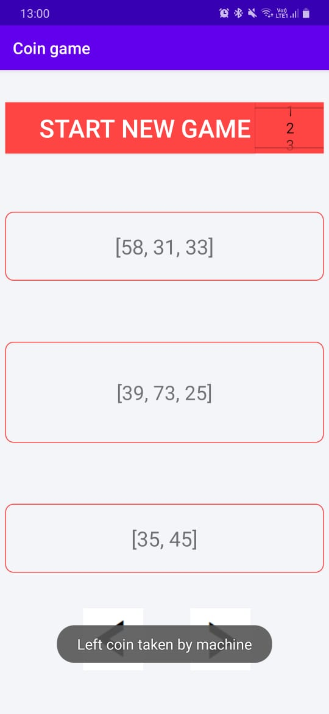
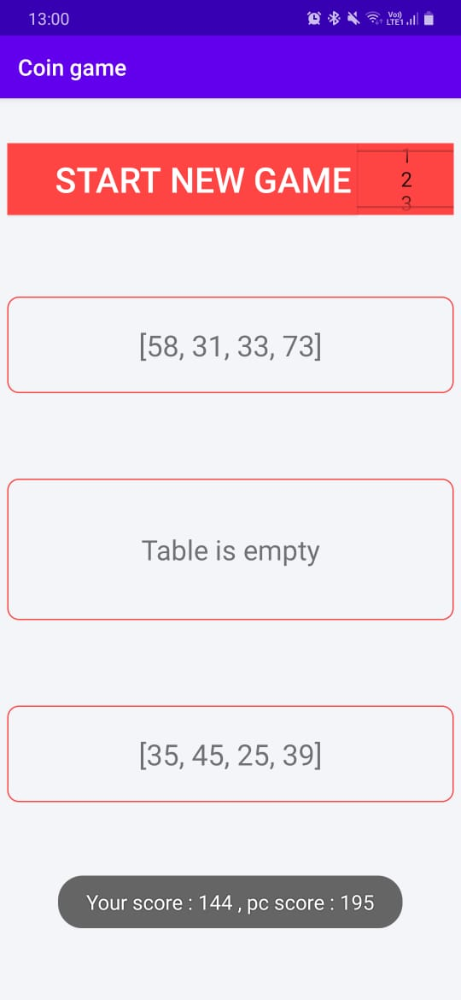
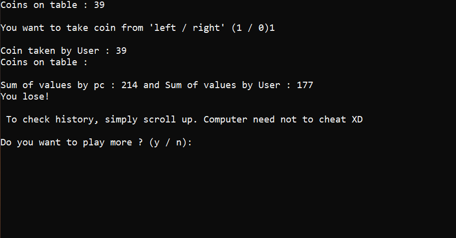

# Coin-strategy-game-challenge

This is a Strategy based game designed for Windows using C++ & for android using Java.

# Initially :
There are some coins in a row (represented by their values)
Windows Welcome screen :

# Rules :
Leftmost or rightmost coin can be taken by the player everytime & players will take coins alternatively.
Images of android app:

More images of Desktop:

# Case :
This game is designed only such that : "Windows / Android device" makes first move.
# Challenging part:
After level 1 / 2 it's next to impossible to win over computer as algorithm is designed to choose coin with strategy.
