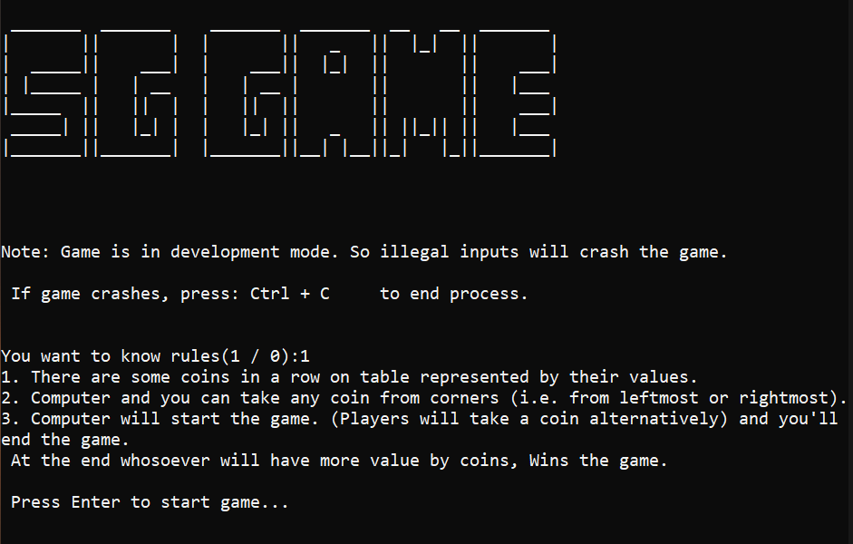
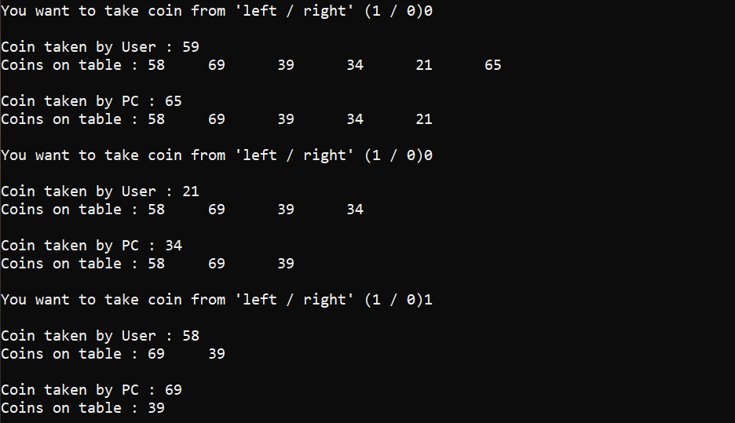

# Coin-strategy-game-challenge
This is a Strategy based game designed for Windows using C++ & for android using Java.

# NOTE :
For Windows version, Downloading Mingw compiler and setting that to path is recommended because, some .dll (Direct Link Library) might be missing in your computer.
To install Mingw and set it's path, you can refer to this short youtube video : https://youtu.be/enL4TajEpN8

# Initially :
There are some coins in a row (represented by their values)
Windows Welcome screen :

# Rules :
Leftmost or rightmost coin can be taken by the player everytime & players will take coins alternatively.
Images of android app:

More images of Desktop:

# Case :
This game is designed only such that : "Windows / Android device" makes first move.
# Challenging part:
After level 1 / 2 it's next to impossible to win over computer as algorithm is designed to choose coin with strategy.
